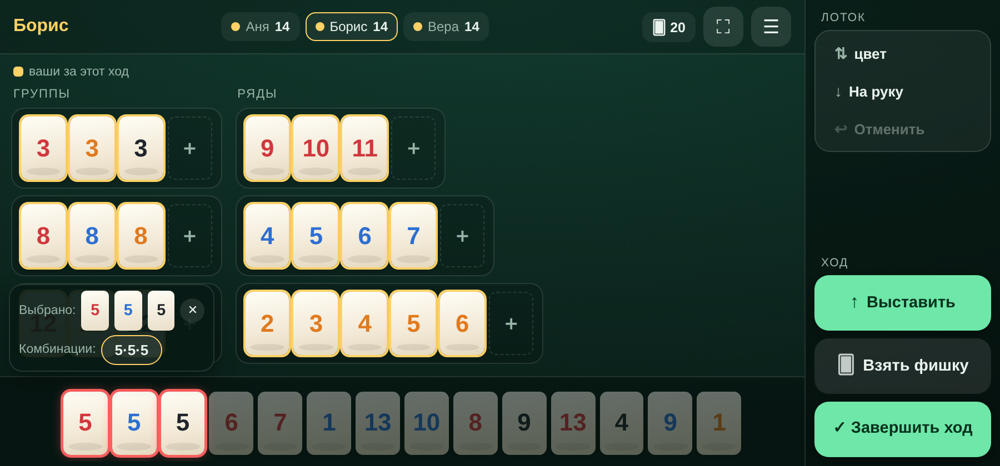
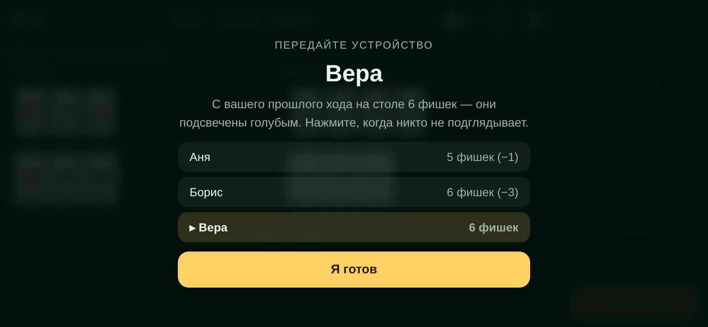
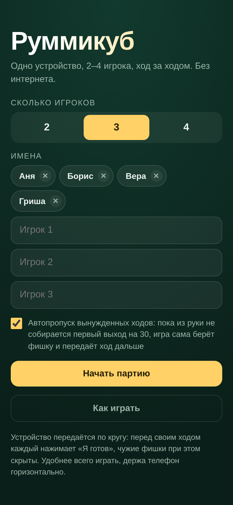

# Руммикуб на одном устройстве

Настольная игра Руммикуб для компании из 2–4 человек, у которой под рукой
один телефон. Никакого сервера, аккаунтов и интернета: устройство передаётся
по кругу, между ходами чужие фишки скрыты, всё считается в браузере, партия
сохраняется сама. Это фанатская некоммерческая реализация классических
правил — сайт-статика, который можно открыть с любого хостинга или
GitHub Pages.

**[▶ Играть](https://avanturist888.github.io/rummi-local/)** — откройте на
телефоне и добавьте на главный экран, после первого запуска игра работает
без сети.



## Что умеет

* **2–4 игрока на одном телефоне.** Перед каждым ходом — экран «Передайте
  устройство»: чужие фишки не видны, игрок жмёт «Я готов» и видит только
  свою руку.
* **Всегда горизонтальная.** Если держать телефон вертикально, игра сама
  поворачивает себя на 90° — работает даже с выключенным автоповоротом
  и на iPhone.
* **Стол раскладывается сам:** группы (одинаковые числа) слева, ряды —
  справа, всё отсортировано.
* **Видно, что изменилось.** Фишки, появившиеся на столе с вашего прошлого
  хода, подсвечены голубым; выложенные вами в этом ходу — золотым; взятые
  из мешка — подсвечены на руке. В шапке — счётчики фишек всех игроков,
  на экране передачи — дельты («Аня — 8 фишек (+2)»).
* **Первый выход без мучений.** Кнопка хода показывает набранную сумму
  («Выход: 21 / 30»), а точный переборный решатель проверяет, собирается ли
  выход вообще. С включённым автодобором игра сразу после раздачи сама
  по кругу добирает фишки каждому, у кого 30 очков не собирается, — партия
  начинается для всех одновременно, и никто не передаёт устройство ради
  вынужденного «взять фишку».
* **Подсказка** находит выход на 30 очков, фишку к чужому набору или новый
  набор — и подсвечивает фишки.
* **Ничего не теряется.** Партия сохраняется на каждом действии и
  продолжается при следующем открытии; случайное «Взять фишку» при
  разложенных фишках переспрашивает; любой шаг можно отменить.
* **Серия партий.** Счёт копится по составу игроков, сами игроки
  запоминаются — на экране настройки их можно выбрать одним тапом.

| Передача устройства | Экран настройки |
| --- | --- |
|  |  |

## Правила вкратце

Стандартный Руммикуб: 106 фишек (числа 1–13 четырёх цветов по две копии
плюс два джокера), каждому раздаётся по 14.

* **Группа** — 3–4 фишки одного числа разных цветов. **Ряд** — 3 и больше
  фишек одного цвета подряд. Джокер заменяет любую фишку.
* **Первый выход** — наборы минимум на 30 очков только из своих фишек.
  До выхода чужие наборы трогать нельзя.
* После выхода стол можно свободно перестраивать — лишь бы к концу хода все
  наборы были правильными и хотя бы одна ваша фишка ушла с руки. Ходить
  нечем — берёшь фишку из мешка.
* Побеждает тот, кто первым выложил все фишки: он получает сумму фишек,
  оставшихся у соперников, остальные — её со знаком минус (джокер на
  руке — 30).

Управление: нажмите фишки (можно несколько), затем набор на столе или
«＋ Новый набор». Полные правила — по кнопке «Как играть» в самой игре.

## Запустить у себя

Это статический сайт без сборки и зависимостей — форкните репозиторий и
включите GitHub Pages:

1. **Settings → Pages → Source: GitHub Actions** — воркфлоу
   `.github/workflows/pages.yml` прогонит тесты и опубликует сайт при пуше
   в `main`. Либо выберите *Deploy from a branch* → `main`, папка `/ (root)`.
2. Игра появится на `https://<логин>.github.io/<репозиторий>/`. Все пути
   относительные, так что работает и в подпапке, и на своём домене.

Локально: `python3 -m http.server 8000` в корне репозитория (ES-модулям
нужен http, просто открыть `index.html` файлом не получится).

После правки файлов поднимите `VERSION` в `sw.js` — иначе у игроков
останется старая версия из офлайн-кэша.

## Устройство проекта

```
index.html          разметка всех экранов
styles.css          оформление, портрет/ландшафт, принудительный поворот
js/rules.js         колода, разбор наборов и рядов, стоимость фишек
js/game.js          состояние партии, ходы, проверка хода, счёт, автопропуск
js/solver.js        точный поиск первого выхода (перебор групп и интервалов)
js/hint.js          подсказка
js/app.js           экраны, выделение фишек, кнопки
sw.js               офлайн-кэш (service worker)
tests/              тесты правил, ходов и решателя
```

Игровая логика не знает про DOM, поэтому проверяется обычными тестами:

```bash
npm test   # node --test, нужен Node 18+
```

---

*Rummikub — товарный знак соответствующих правообладателей. Этот проект —
любительская некоммерческая реализация правил для игры в кругу семьи, не
связанная с правообладателями.*
